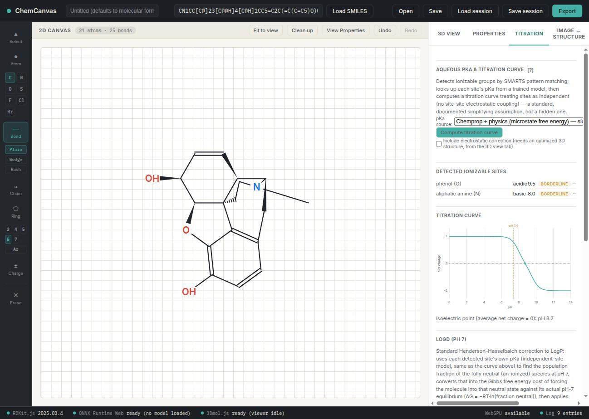

# Physics + Chemprop aqueous pKa (`pka-microstate-freeenergy`) — integration notes

## What this is

A second, independent aqueous pKa predictor alongside the older
`aqueous-pka` atom-level regressor (see `PKA_INTEGRATION.md` for the
*carbon-acid* C-H model, a different thing entirely). Instead of
regressing pKa directly, this model predicts a per-microstate free
energy and combines a site's protonated/deprotonated pair through the
real thermodynamic-cycle formula (Uni-pKa, Luo/Zhou et al., JACS Au
2024): `pKa = [logsumexp(-g_protonated) - logsumexp(-g_deprotonated)] / ln(10)`.
Each microstate's free energy is `g = physical_scale*physical_baseline +
physical_offset + chemprop_correction`, an explicit delta-learning
correction on top of a real classical physical baseline (NAGL-MBIS
charges → SMIRNOFF Sage geometry optimization with implicit GB/SA
solvent, `js/pka-physical-baseline.js`) — not a black-box regression.
Full architecture, training data, and honesty-documented metrics live in
`model/registry.json`'s `pka-microstate-freeenergy` entry (surfaced in
the app itself via the Titration tab's `[?]` info button); this file is
a narrative walkthrough of one real example rather than a duplicate of
that data.

## Worked example: morphine

Morphine is a good illustration because it has **two real, independent,
well-separated ionizable sites** (a phenol and a tertiary aliphatic
amine, on opposite ends of the molecule — no adjacent-site zwitterion
complication the way salicylic acid's phenol/carboxylic-acid pair has)
and because its real experimental pKa values are directly present in
this checkpoint's own training data (curated by pKaHub from OCHEM, not
looked up separately for this writeup):

| Site | Real pKa (training data, OCHEM aggregation) | Predicted (live) | Error | Confidence badge |
|---|---|---|---|---|
| Phenol | 9.555 (2 measurements) | 9.5 | 0.06 | Borderline |
| Aliphatic amine | 8.163 (3 measurements) | 8.0 | 0.16 | Borderline |

Both predictions land well inside typical experimental replicate
scatter — genuinely good agreement, better than this checkpoint's own
headline **external-benchmark MAE of 0.82** (Novartis + SAMPL6/7/8 +
euroSAMPL1, none of which this checkpoint trained on; see
`model/registry.json`'s `metrics` block). That's the "good" half.

The "not perfect" half is more interesting than a plain numeric miss:
**both sites are flagged "Borderline," not "In-domain."** The
applicability-domain confidence badge is a heuristic distance, in the
D-MPNN's own learned embedding space, from a query microstate to the
training distribution (`js/applicability-domain.js`) — it is not
derived from, or a proxy for, how large the eventual error will be. It
flags morphine's rigid, fused pentacyclic scaffold as structurally
atypical relative to the flatter, more conformationally flexible
acids/bases that dominate this model's training set (IUPAC digitized
pKa + Baltruschat & Czodrowski + pKaHub — see `dataset.name` in the
registry entry), independent of the fact that the correction network
happened to get both numbers right this time. That's the honest
takeaway: a Borderline badge means "structurally less like what this
model learned from," not "probably wrong" — and an In-domain badge
elsewhere is not a guarantee either. Treat the badge and the number as
two separate signals, not one folded into the other.

(Reproducing this exact run: load SMILES
`CN1CC[C@]23[C@@H]4[C@H]1CC5=C2C(=C(C=C5)O)O[C@H]3[C@H](C=C4)O`, open the
Titration tab, pick "Chemprop + physics (microstate free energy)" as the
pKa source, and click Compute. The physical baseline's conformer search
has real run-to-run jitter — typically a few hundredths of a pKa unit,
occasionally more — so don't expect bit-identical numbers on a rerun.)

## Honest accuracy summary

From `model/registry.json`'s `metrics` block (see that entry's own
`note` for the full explanation of why the internal scaffold-split test
MAE, 1.15, looks worse than the external number despite being the
better-trained checkpoint):

| | MAE (pKa units) |
|---|---|
| External benchmark (Novartis + SAMPL6/7/8 + euroSAMPL1, held out entirely) | 0.82 |
| Physical baseline alone, recalibrated, no ML correction | 6.72 |
| Physical baseline alone, raw (no recalibration at all) | 16.44 |

The correction network is doing essentially all of the real work; the
physical baseline's contribution is mostly in the recalibrated *scale*
of the correction it has to learn, not in independently useful pKa
signal on its own.

## Known limitations

Not repeated here in full — `model/registry.json`'s `knownLimitations`
array (rendered in the app's own `[?]` info popup) is the maintained,
authoritative list, and includes real, previously-undetected bugs found
and fixed during development (a zwitterion-reference mismatch that
cross-wired ~4-24% of training rows depending on source; a logP
feature-fusion offline/online mismatch). Two worth calling out here
because they're directly visible in the worked example above:

- **Independent-site scope.** Each site is scored with every *other*
  site held at its default reference protonation state, not the real
  simultaneous multi-site equilibrium — a documented simplification
  (same one `aqueous-pka` already makes), not a hidden one. A real
  Generalized-Born charge-charge correction (`js/pka-electrostatic-
  correction.js`) can be applied afterward for 2+ sites, but it needs an
  optimized 3D structure from the 3D view tab first — the screenshot
  above shows the *uncorrected* per-site values (`—` in the "corrected"
  column), which is what a user sees by default.
- **The applicability-domain badge is heuristic, not calibrated** — see
  the morphine example above. It is explicitly documented (both in the
  `[?]` info popup and in `js/applicability-domain.js`'s own header) as
  a distance-based signal, not a calibrated confidence interval.
