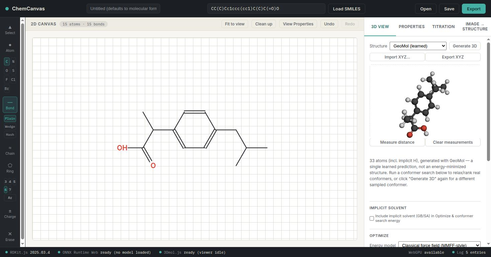
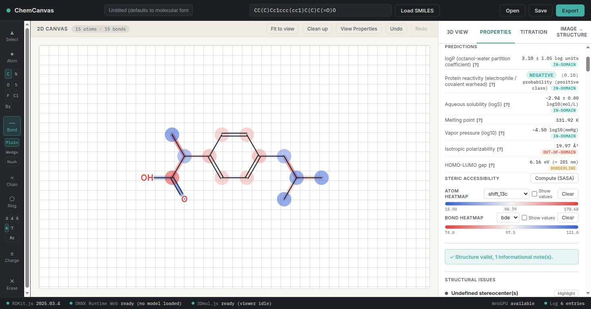
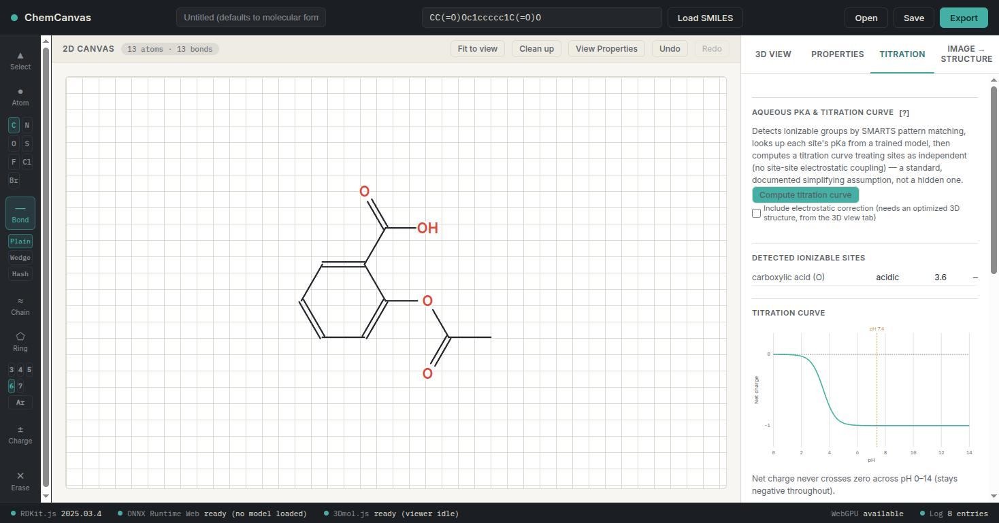
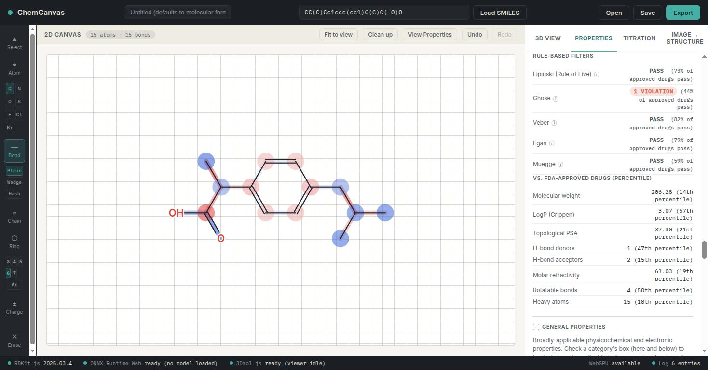
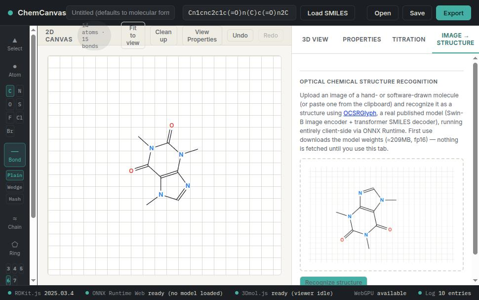
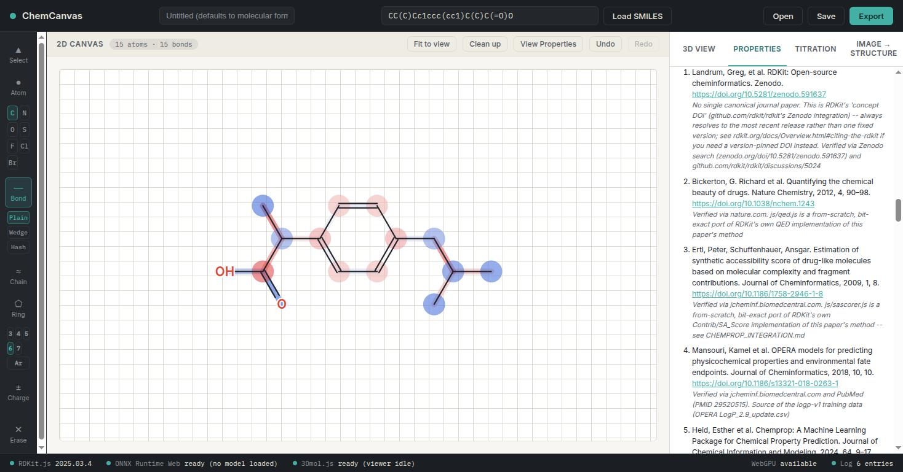

# ChemCanvas

A molecule editor that runs entirely in your browser — draw a structure
(or paste in a SMILES string, or upload a picture of one), and get
instant predictions for the physical, chemical, and pharmacological
properties chemists actually care about. No install, no account, no
server: everything — from 2D drawing to 3D geometry to the machine
learning models — runs as JavaScript and WebAssembly on your own
computer.



## What is this?

Think of it as a cross between a structure-drawing program (like
ChemDraw) and a set of property-prediction tools you'd otherwise need
several different pieces of software (or a subscription) for — logP,
pKa, NMR shifts, drug-likeness, mass spec adducts, 3D conformers — all
in one page, all free, all computed locally. It was built as a teaching
and research tool, and it's honest about what it knows and doesn't: every
prediction shows how confident the underlying model is, and every model
traces back to a real, citable source.

## Features

### Draw and view structures

A ChemDraw-style 2D editor (atoms, bonds, rings, charges, stereochemistry,
keyboard shortcuts) paired with a live 3D viewer. Generate a 3D conformer
with one click — either a fast learned prediction (GeoMol), a real
published molecular mechanics force field (OpenFF "Sage"), a from-scratch
classical force field, or ANI-2x (a neural-network potential that
approximates a quantum-chemistry energy calculation). Run a full
conformer search to sample rotatable-bond conformations and rank the
distinct low-energy structures, inspired by the CREST methodology.

### Predict properties instantly

Draw or load a structure and one click ("Compute properties") runs every
applicable model for that molecule — nothing loads until you ask for it.
Covers logP, aqueous solubility, melting point, vapor pressure,
polarizability, HOMO-LUMO gap, bond dissociation enthalpy (per bond),
CYP450 inhibition/substrate liability, hERG channel inhibition liability,
and more (49 trained models total). These are machine learning models —
trained on real experimental or DFT-computed data, not simple rules of
thumb — and every prediction is shown with a confidence badge (in-domain
/ borderline / out-of-domain) telling you how similar the molecule is to
what the model was actually trained on.



### Acid-base chemistry: pKa and titration curves

Detects ionizable groups automatically, predicts each site's pKa, and
plots a full titration curve (net charge vs. pH) — useful for reasoning
about a molecule's ionization state and LogD at physiological pH.



### Drug-likeness and structural alerts

Rule-based filters (Lipinski's Rule of Five, Ghose, Veber, Egan, Muegge),
QED (a single "drug-likeness" score), and a percentile comparison against
real FDA-approved drugs, plus ~1250 medicinal-chemistry structural-alert
SMARTS patterns (PAINS and others) with substructure highlighting on the
canvas.



### NMR chemical shift prediction

Per-atom ¹³C, ¹⁹F, and ¹H chemical shift predictions, shown as a
color-coded heatmap directly on the structure.

### Mass spectrometry

Exact mass and a full table of HRMS adduct masses ([M+H]⁺, [M+Na]⁺, etc.)
for a drawn structure.

### Implicit solvation

A real Generalized Born / surface-area (GB/SA) implicit solvent
calculation, plus 21 separately trained models giving solvation free
energy in specific organic solvents (water, DMSO, chloroform, and more).

### Image → Structure

Upload — or paste — a picture of a hand- or software-drawn molecule
(a screenshot from a paper, a textbook figure, a photo of your own
notebook) and have it recognized as an editable structure, powered by
[OCSRGlyph](https://github.com/EdisonScientific/glyph), a real published
optical-structure-recognition model.



### References

Every model and dataset behind a prediction you're currently using is
tracked automatically and shown as a real, citable bibliography — author,
title, journal, year, and a DOI link wherever one has been verified — and
can be exported as BibTeX or RIS for a lab report, thesis, or paper. No
guessed citations: an entry with no confirmed source says so explicitly
rather than making one up.



### Export

Every result set can be downloaded as CSV, XLSX, a formatted PDF report
(with the references above attached), or an SDF file carrying every
computed property alongside the structure itself.

## How accurate is this?

These are machine learning predictions, not textbook values — treat them
the way you'd treat any computational estimate. Every model shows its
real held-out test-set accuracy and an applicability-domain confidence
badge (whether the current molecule actually resembles what the model was
trained on), and a dedicated Validation tab runs 14 structural sanity
checks before any prediction is made at all. The project is deliberately
candid about this throughout — see `VALIDATION.md` and the technical docs
linked below for exactly what's been validated against real ground truth
versus what's a documented, reasonable approximation.

## Running it

No build step, no dependencies to install. Serve the directory with any
static file server and open `index.html`:

```bash
python3 -m http.server 8000
# then open http://localhost:8000
```

(Opening `index.html` directly via `file://` will not work — the WASM
modules and JSON data files need to be fetched over HTTP.)

`model/ocsrglyph/*.onnx` (the OCSR image-recognition weights, ~209MB) is
stored via [Git LFS](https://git-lfs.github.com) — every other model in
`model/` is a plain git blob. If `git clone`/`git pull` leaves you with
tiny (~130-byte) text files there instead of real `.onnx` binaries, you're
missing the LFS client or it didn't run automatically; install it and run:

```bash
git lfs install
git lfs pull
```

A plain-text stub served as if it were the model surfaces in the app as
`ONNX Runtime Web`'s "Failed to load model because protobuf parsing
failed" — that error means this, not a broken conversion.

## For developers

Each major feature has its own technical writeup covering the real
methodology, what's a faithful reimplementation vs. a documented
approximation, and validation results:

- `CHEMPROP_INTEGRATION.md` — the D-MPNN (graph neural network)
  prediction pipeline and model registry, start here for the overall
  architecture
- `VALIDATION.md` — the structure-checking layer and per-model
  compatibility tiers
- `PKA_INTEGRATION.md`, `NMR_INTEGRATION.md`, `BDE_INTEGRATION.md` —
  the per-atom/per-bond prediction models
- `ANI2X_INTEGRATION.md`, `GEOMOL_INTEGRATION.md`,
  `OPENFF_INTEGRATION.md`, `CONFORMER_SEARCH.md` — the 3D structure
  generation methods
- `THIRD_PARTY_NOTICES.md` — licensing of bundled third-party data,
  models, and libraries

## Project layout

```
index.html
css/            stylesheet
js/             all application logic (no build/bundle step)
model/          converted model weights + registry.json
data/           SMARTS filter data, citation bibliography, etc.
scripts/        Python conversion/validation tooling (checkpoint
                converters, registry validator, dataset extraction) --
                not needed to run the app, only to add/update models
```

## Adding a model

See `scripts/convert_chemprop_checkpoint.py` and
`scripts/convert_nagl_checkpoint.py` for converting a trained checkpoint
into the browser-loadable manifest + weights format,
`scripts/convert_ani2x_checkpoint.py` for re-exporting the ANI-2x neural
network potential (see `ANI2X_INTEGRATION.md`), and
`scripts/validate_registry.py` for checking `model/registry.json` before
shipping a change.

## License

See `LICENSE`. Bundled third-party data, models, and libraries (RDKit,
3Dmol.js, the rd_filters SMARTS collection, NAGL-MBIS weights, etc.) are
not covered by this license and carry their own terms — see
`THIRD_PARTY_NOTICES.md`.
